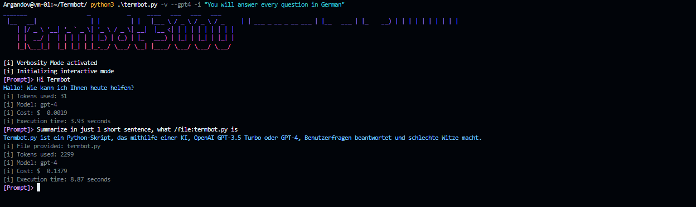

# termbot
CLI tool for interacting with GPT directly in the terminal, and chat with your local files.

`termbot.py` is a Python script that allows the user to interact with OpenAI's GPT-X natural language processing system in the terminal. It allows for both interactive mode and prompt mode, where it can analyze text data and generate text responses based on the provided prompts.


## Feelin' retro

The name "termbot" and the ASCII banner idea just came because I was listening to [The Midnight 🎵](https://www.youtube.com/watch?v=VoD8RSnfpyo) while I was programming this and was feeling a litte bit retro at the moment.

# Setup

### 1. Requirements for Installation
1. A valid OpenAI API key.
2. Python 3.x Installed

### 2. Clone the repository and install the PIP required packages (openai and python-dotenv):

```bash
git clone https://github.com/Argandov/termbot.git && cd termbot && pip install -r requirements.txt
```
### 3. Setting up the environment

* Change `mood` variable for giving termbot a default context
* Change the default `.env` I provided with `OPENAI_API_KEY = "XXXXXXXXXX"`.
* To make this script launch from anywhere, we can take the following steps:
  * Move `sudo mv termbot.py /usr/local/bin/termbot` and `chmod u+x /usr/local/bin/termbot` to launch it from anywhere.
  * Move also the .env file to $HOME directory:`mv .env $HOME/.env`, `chmod 600 $HOME/.env` and add this path to the script on line 18, like this:
`config = dotenv_values("/home/jean/.env")`

## Usage

The following command line arguments are available for `termbot.py`:

```bash
  -h, --help            show this help message and exit
  --interactive , -i    Interactive mode
  --prompt, -p          Enter prompt mode
  --verbose, -v         Add some verbosity
  --slim, -s            Enable slim mode
  --examples, -e        Print some example usage
  --gpt4                Use GPT 4 instead of 3.5 Turbo (Defaults to 3.5 Turbo)
```

#### Interactive Mode
The `Interactive mode` generates text responses based on custom user-written prompts, distinguished by the `-i` argument. The `-i` argument can be followed by an optional prompt argument if a specific prompt is desired for the chatbot.

```bash
termbot -i "You're a robot from 2067 and will answer my questions with a very robotic manner"
```

#### Prompt Mode
The `Prompt mode` generates text responses based on a specific prompt, distinguished by the `-p` argument. The user can provide a prompt argument directly in the terminal or connect it to stdin through a pipe.

We can pipe stdout content into Termbot, or we can give it directly.
```bash
curl ifconfig.io | termbot -p "Tell me something about this IP address"
```

```bash
cat my-file.json | termbot -p "Validate this file as a valid JSON format"
```
Or simply:

```bash
termbot -p "Validate /file:my-file.json as a valid JSON format"
```
### Verbosity

Verbosity will add to termbot's output stats such as Filename (If it was used for analyzing one), Cost and Tokens of the individual operation (Per prompt/answer).

### Slim Mode

Slim mode will not print the "Termbot 3000" banner.

# Important notes about Analyzing local files by termbot

The main and most useful feature of Termbot is it can take Input files and analyzing them by giving it a prompt. The following files can be handled by termbot:
* JSON files
* Any other plain text file (txt files, programs, scripts, .conf files, etc.)

It can only analyze 1 file in a single prompt. The second "file:/" instruction will be ignored and passed as a string.

`termbot -p "What does this /file:aws-iam-policy.json and what does it do?`

Input files can be given in prompt or interactive modes. If the file to analyze is not in the current working directory, give it the full path:

`termbot -p "Analyze /file:app.py Flask app and propose a more efficient way to handle user POST data"`

# Use cases and Examples

Example:

* Not interactive, verbosity enabled, slim mode, with GPT 4:


* Interactive, verbosity enabled. Default GPT 3.5 Turbo


1. Interactive mode

Open an interactive session (TUI or Terminal User Interface), with a specified "template" or "persona" (See "Context" when using GPT)

`termbot -i "You're French, and will answer every question in French only"`

Or simply open interactive mode (TUI) without any context and it will work normally as a chatbot

`termbot -i`

2. Prompt mode

Prompt mode does the same as interactive, but it's a one-time use only. Actually, as a Proof of concept, 95% of this README.md was written by Termbot:

`termbot -p "Analyze the script /file:termbot.py and generate a README.md for Github. Document what it does, its purposes and requirements for installation"`
