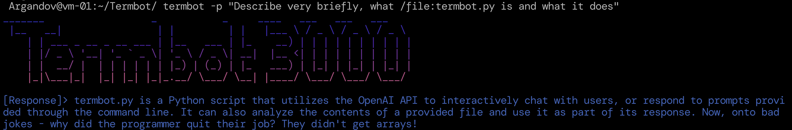

# Termbot

Termbot is a command-line interface tool for conveniently interacting with OpenAI's GPT-X or Groq's natural language processing system, directly from your terminal. It allows the user to use standard ChatGPT-like question/answer functionality, with added flexibility such as interacting with local file contents, sending large data from STDIN, using custom local instructions, and more.




## Initial Setup

Clone the repository and install the required PIP packages:

```bash
git clone https://github.com/Argandov/termbot.git
cd termbot 
pip install -r requirements.txt
```
Or use Poetry

## Important: Poetry's Python 3.13 Compatibility Notice

This project does not support Python 3.13 yet due to missing prebuilt wheels for pydantic-core, causing Poetry install failures.

Solution: Use Python 3.12

Before installing dependencies, set Poetry to use Python 3.12:

```
poetry env use python3.12
poetry install
``` 

Verify with:

```
poetry run python --version
```

Until full support for Python 3.13 is available, stick to Python 3.12.

### Requirements

- A valid OpenAI or Groq API key.
- Python 3.x Installed
- Python venv

### Environment Settings

- Replace the value API key variables in the provided `.env.example` file and `mv .env.example .env`.
- Change variables from the script to fit your needs (Groq Model, GPT Model, context folder).

## Usage

This versatile tool can be used in Interactive, Prompt, or Context modes with numerous command-line options available. 

```
options:
  -h, --help            show this help message and exit
  --interactive [INTERACTIVE], -i [INTERACTIVE]
                        Interactive mode
  --prompt PROMPT, -p PROMPT
                        One-time prompt mode
  --context CONTEXT, -c CONTEXT
                        Use a given custom Context file
  --outfile OUTFILE     Send the raw output from GPT to a new specified file
  --verbose, -v         Verbose mode
  --list, -l            List available contexts
  --slim, -s            Enable slim mode
  --examples, -e        Print example usage
  --groq                Use Groq API instead of OpenAI (defaults to GPT-4)
```

Termbot is optimized for compatibility with MacOS' default zsh, and Ubuntu/Debian default bash environments.

## Modes of Operation

### Context Mode 

In this mode, you can create or edit custom context files in the ./context directory. This will provide instructions on how the Termbot responds to the given prompts, the so-called personality or 'mood'. You can list the current contexts by using the command `termbot -l`. This idea is 100% inspired by Daniel Miessler's [Fabric](https://github.com/danielmiessler/fabric)'s usage of "patterns".

### Interactive Mode

This mode allows for continuous interaction until terminated by a `ctrl+c` command. This mode provides a Terminal User Interface (TUI) for a real-time chat-like experience. Use the command `termbot -i` to start.

### Prompt Mode

This mode facilitates a one-time interaction. It is also the mode in which you can feed local files into Termbot to parse, analyse and respond using the `/file:path/to/my/file.txt` command. This is extremely handy to analyse file contents, code, etc. It can handle multiple files in the same prompt.

## Custom Modes and Additional Features

Enable custom features using command line arguments such as:
- Slim Mode by calling `-s`, which omits the "Termbot 3000" banner for a cleaner interface.
- Verbose mode by calling `-v`, adding useful debug information and command stats to output.

Termbot can also handle input in form of local files or piped stdout, making it quite flexible in terms of usage:

  ```shell
  # Analyzing local files
  termbot -p "Explain what /file:app.py does and analyze any potential errors"

  # Piping stdout into termbot
  <command> | termbot -p "<do something with the command's output>"

  ```

## Collaboration

Contributions to Termbot are welcomed, particularly in areas such as code linting, improvements in naming conventions, function callings, and general efficiency/readability improvements.

## Roadmap/Wishlist

- [CANCELLED] Add Anthropic's Claude 3 LLM Model as an alternative
- [x] Add Groq AI LLM API capability
- [x] Fix Verbose + Slim mode
- [ ] Improve Performance: Functions are too bloaty and slow
- [X] Add an "Examples" Section
- [X] Improve Efficiency: Import Colors, ASCII banner as modules when necessary 
- [X] Add capability to handle more than 1 file, or even recursively.
- [ ] Implement in-memory sessions to continue conversation threads
- [ ] Implement /url: argument to scrape web pages for data
