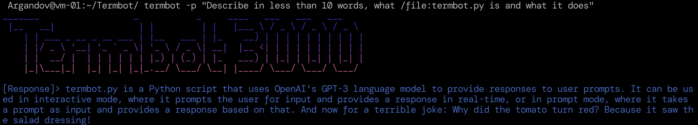

# termbot
CLI tool for interacting with GPT, analyze local files, etc.

`termbot.py` is a Python script that allows the user to interact with OpenAI's GPT-3 natural language processing system in the terminal. It allows for both interactive mode and prompt mode, where it can analyze text data and generate text responses based on the provided prompts.



### Requirements for Installation
1. A valid OpenAI API key.
2. Python 3.x
3. `openai`, `dotenv`, and `argparse` Python libraries.

### Installation/Setup:

* For now, we can move `sudo mv termbot.py /usr/local/bin/termbot` and `chmod u+x /usr/local/bin/termbot` to launch it from anywhere.
* Create a .env file with `OPENAI_API_KEY = "XXXXXXXXXX"` in $HOME folder, `chmod 600 $HOME/.env` and add the path to the script:
`config = dotenv_values(".env")` (For now)
* By default, it uses GPT-3.5-TURBO. Change `OPENAI_MODEL = "gpt-3.5-turbo"` variable for another model if desired.
* Change `mood` variable for giving termbot a default context

### Usage
The following command line arguments are available for `termbot.py`:

```bash
--interactive, -i    Interactive mode.
--prompt, -p        Enter prompt mode.
--verbose, -v       Add some verbosity.
--silent, -s        Don't print banner.
--examples, -e      Print some example usage.
```
*Currently "Silent" and "Verbose" mode are Work In Progress.

#### Interactive Mode
The `Interactive mode` generates text responses based on custom user-written prompts, distinguished by the `-i` argument. The `-i` argument can be followed by an optional prompt argument if a specific prompt is desired for the chatbot.

```bash
termbot -i "You're a robot from 2067 and will answer my questions with a very robotic manner"
```

#### Prompt Mode
The `Prompt mode` generates text responses based on a specific prompt, distinguished by the `-p` argument. The user can provide a prompt argument directly in the terminal or connect it to stdin through a pipe.

We can pipe stdout content into Termbot, or we can give it directly.
```bash
curl ifconfig.io | termbot -p "Tell me something about this IP address"
```

```bash
cat my-file.json | termbot -p "Validate this file as a valid JSON format"
```
Or simply:

```bash
termbot -p "Validate /file:my-file.json as a valid JSON format"
```

Please note that there is also an optional `--verbose` flag that can provide more detailed information about the runtime process.

### Analyzing local files by termbot

Input files are given to termbot in the following format. Currently it analyzes any file format, and it has a special feature for handling also JSON files:

`termbot -p "What does this /file:aws-iam-policy.json and what does it do?`

Input files can be given in prompt or interactive modes. If the file to analyze is not in the current working directory, give it the full path:

`termbot -p "Analyze /file:app.py Flask app and propose a more efficient way to handle user POST data"`


### Verbosity (Work in progress)

Verbosity will add to termbot's output stats such as Filename (If it was used for analyzing one), Cost and Tokens of the individual operation (Per prompt/answer).

### Silent Mode (Work in progress)

Silent Mode is a Work in Progress, and will omit the Termbot ASCII banner.

# Use cases and Examples

1. Interactive mode

Open an interactive session (TUI or Terminal User Interface), with a specified "template" or "persona" (See "Context" when using GPT)

`termbot -i "You're French, and will answer every question in French only"`

Or simply open interactive mode (TUI) without any context and it will work normally as a chatbot

`termbot -i`

2. Prompt mode

Prompt mode does the same as interactive, but it's a one-time use only. Actually, as a Proof of concept, 95% of this README.md was written by Termbot:
`termbot -p "Analyze the script /file:termbot.py and generate a README.md for Github. Document what it does, its purposes and requirements for installation"`
