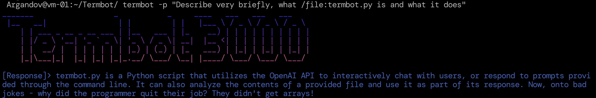
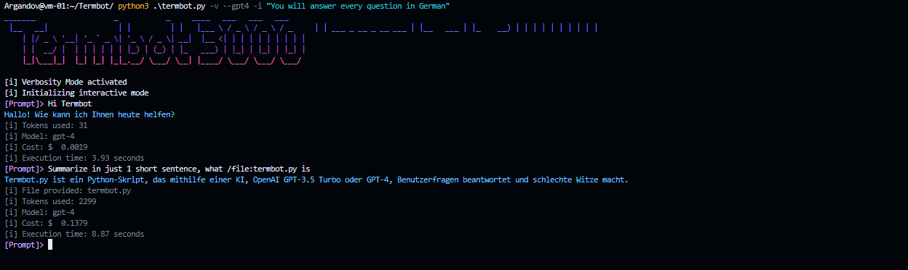

# termbot
CLI tool for interacting with GPT directly in the terminal, and chat with your local files.

`termbot.py` is a Python script that allows the user to interact with OpenAI's GPT-X natural language processing system in the terminal. It allows for the usual question/answer ChatGPT-like functionality, but with a lot more flexibility like sending local file contents, send large data from STDIN, have custom local instructions, etc.

# Notes about this new version:
Termbot originally was a project kept in the dust, until I read about Daniel Miessler's [Fabric](https://github.com/danielmiessler/fabric?tab=readme-ov-file), which is basically the same idea, but it has some features I decided to add in the 2nd version of Termbot. I will here acknowledge Daniel Miessler for the inspiration for having a sepparate context folder with contexts that are selectable, easier to modify, and more permanent. Also, him showcasing Fabric was the motivation to open up my IDE and make Termbot 30% more useful than the first version.

Termbot is still a Work in Progress and there are some minor issues to address, and extra functionalities I'd like to explore.

Jump directly to [Use cases and Examples](https://github.com/Argandov/termbot#more-use-cases-and-examples)



## Feelin' retro

The name "termbot 3000" and the ASCII banner idea just came because I was listening to [The Midnight 🎵](https://www.youtube.com/watch?v=VoD8RSnfpyo) while I was programming this and was feeling a litte bit retro at the moment.

## Disclaimer

As always with any third-party tool, specially with GPT, be careful what information you share with OpenAI. If necessary, change sensitive information at standard output (stdout), obscure the info and then use it. Use your best judgement for this.

## Limitations

* It is not recommended to install PIP packages globally (System-wide) so we need to set up a new Venv to use Termbot
* This program does NOT have memory yet. It cannot sustain a conversation, or have any information about previous prompts/answers.
* Currently it can only analyze 1 file per prompt. (If we provide, for example `analyze /file:hello.txt, and compare it with /file:hello2.txt` the second "file:/" will be passed as a string)

## Compatibility

* Termbot has been tested on MacOS' default zsh, and Ubuntu/Debian default bash environments only.

# Setup

### 1. Requirements for Installation
1. A valid OpenAI API key.
2. Python 3.x Installed
3. Python venv

### 2. Clone the repository and install the PIP required packages (openai and python-dotenv):

```bash
git clone https://github.com/Argandov/termbot.git && cd termbot && pip install -r requirements.txt
```
### 3. Setting up the environment

* Change `mood` variable for giving termbot a default context
* Change the default `.env` I provided with `OPENAI_API_KEY = "XXXXXXXXXX"`.
* To make this script launch from anywhere, we can take the following steps:
  * Move `sudo mv termbot.py /usr/local/bin/termbot` and `chmod u+x /usr/local/bin/termbot` to launch it from anywhere.
  * Move also the .env file to $HOME directory:`mv .env $HOME/.env`, `chmod 600 $HOME/.env` and add this path to the script on line 18, like this:
`config = dotenv_values("/home/jean/.env")`
* OR, just for testing purposes, do `alias termbot=/path/to/termbot.py` and execute `termbot` from anywhere.

# **Usage**

The following command line arguments are available for `termbot.py`:

```
options:
  -h, --help            show this help message and exit
  --interactive [INTERACTIVE], -i [INTERACTIVE]
                        Interactive mode
  --prompt PROMPT, -p PROMPT
                        Enter prompt mode
  --context CONTEXT, -c CONTEXT
                        Use a given custom Context file. DO NOT USE "PROMPT MODE"
  --outfile OUTFILE     Send the raw output from GPT to a new specified file
  --verbose, -v         Add some verbosity
  --list, -l            List available contexts
  --slim, -s            Enable slim mode
  --examples, -e        Print some example usage
  --gpt4                Use GPT 4 instead of 3.5 Turbo (Defaults to 3.5 Turbo)
```

**Interactive vs. Prompt vs. Context modes**

- Interactive will open a TUI (Terminal User Interface) to continuously prompt GPT until `ctrl+c` breaks the execution. Works well with analyzing files. Do not pipe stdout into interactive mode.
- Prompt mode will be a one-time prompt/response interaction. This way, we can pipe stdout commands into it, or analyze files on the fly.
- Context Mode will have context files added as, well, contexts. Like a set of instructions for how GPT will behave and respond. (See [Use cases and Examples](https://github.com/Argandov/termbot/edit/main/README.md#more-use-cases-and-examples). 

## **Verbosity & Output modes**

1. Verbosity

Verbosity (`-v`) will add to termbot's output useful stats in color gray, such as:

- Filename (If it was used for analyzing one),
- Model used (GPT 3.5 Turbo or GPT 4)
- Cost of individual operation (Per prompt/answer) - **Only an estimation**.
- Tokens used by the individual operation (Per prompt/answer).
- Execution time per prompt/answer

Example:

```
 termbot -s -v -p "analyze /file:output.nmap"
It seems like the nmap scan was performed on the host scanme.nmap.org and it discovered that the 5550/tcp port is open and running the sdadmind service. This information could be useful for further investigation and analysis.

[i] File provided: output.nmap
[i] Tokens used: 259
[i] Model: gpt-3.5-turbo
[i] Cost: $  0.0005
[i] Execution time: 7.89 seconds

```

1. Output to a file
- It will write the raw GPT response into a specified file without stats (verbose mode), shell color codes, or the banner (i.e. `termbot -p "hello, who are you?" -o test_output.txt`

## **Additional Info & Features**

1. **About usage of GPT**
- By default, termbot uses GPT-4. We can add another model if needed in the OPENAI_MODEL variable.
- I have yet to figure out how to chunk the input data correctly. A lot of bugs still present, specially when reading files in “prompt” mode.
- However, we can pass in large amounts of data to GPT in “context” mode and stdin.

2. **Slim Mode**

Slim mode will not print the "Termbot 3000" banner (But will still use blue color for output, and gray verbose information).

2. **Analyzing local files or stdout by termbot**

The 2 most interesting features of Termbot are:

- It can take Input files and analyzing them by giving it a prompt with `/file:` as the “queue” to read a local file (i.e. `termbot -p "Explain what /file:app.py does and analyze any potential errors"` or:
- We can "pipe" stdout into termbot `<command> | termbot -p "<do something with the command's output>"`
    
    (See [Use cases and Examples](https://github.com/Argandov/termbot/edit/main/README.md#more-use-cases-and-examples))

The following files can be handled by termbot:

* JSON files
* Any other plain text file (txt files, programs, scripts, .conf files, etc.)

# How do the different modes work together

Termbot is extremely flexible, and the modes:

- Prompt,
- Context,
- Stdin,

Can work together, or standalone, so there can be a lot of combinations, like:

- Giving a “context” to instruct GPT how to respond AND giving data to analyze through stdin or “prompt”,
- Giving some data through stdin, and giving instructions through “prompt” when we want quick chat questions/answers,
- Simply use the “prompt” alone to give both the instructions and data to analyze, just the same way we use ChatGPT by default (i.e. “When was Toyota founded. Please answer in spanish”

[See Use Cases for examples on how to use them](https://github.com/Argandov/termbot/edit/main/README.md#actual-use-cases--examples)

How it actually looks:
* Not interactive, verbosity enabled, slim mode, with GPT 4:


* Interactive, verbosity enabled. GPT 4



1. Context mode
- You can generate, or edit customized context files in the `./context` directory, which will be passed in as instructions (”*You’re a Marketing expert and will answer in French only*”, etc).
- You can list the current “contexts” by using `termbot -l`
- Context works in addition to prompt mode, and/or stdin, so we can work with a context (How we want the GPT to respond or generate the results), a prompt (What we want it to do), a stdin (What we want it to analyze).
2. Interactive mode

Open an interactive session (TUI or Terminal User Interface), with a specified "template" or "persona" (See "Context" when using GPT). It will override the default "mood" context.

`termbot -i "You're French, and will answer every question in French only"`

Or simply open interactive mode (TUI) without any context and it will work normally as a chatbot, with the default "mood" context.

`termbot -i`

3. Prompt mode

Prompt mode does the same as interactive, but it's a one-time use only.

- Prompt mode’s primary function is to be the most basic chatbot. Just use `termbot -p "When was Toyota founded?"`
- It can read files by using “`/file:my_file.txt`” in the prompt string. This files should be Raw (It does not parse PDFs or other types of files. It reads raw contents by now).
    - JSON Files: There’s a special feature that allows us to treat the `/file:` file as a JSON file,
    - Otherwise, it will be passed in as raw text (Program files, texts, Python scripts, whatever)
    - Example: `termbot -p "What does /file:app.py do?"`
- Prompt mode will be “appended” to the desired “Mood”. Mood is the “context” given (See: context)

# Actual Use Cases & Examples:

The most basic use case possible:

- `termbot -p "Why are vegetables called that way?"`

Give it a file and "analyze" it:

- `termbot -p "Please review the SSHD configuration file /file:/etc/ssh/sshd_config and assess its overall security security. Identify any potential vulnerabilities, recommend improvements, and suggest best practices to enhance the overall security of the SSH server.`
- `termbot -p "What does this /file:aws-iam-policy.json and what does it do?`
- `termbot -p "Analyze /file:app.py Flask app and propose a more efficient way to handle user POST data"`

...Or piping command output into Termbot:

- Having some data copied into the computer’s clipboard and having a “expert_blog_writer” written instructions to specify Termbot to condense information and generate a blog post:`pbpaste | termbot -s -v -p “Extract the most important information from this text” -c expert_blog_writer`
- `strings -n 8 -td malware_sample.exe | termbot -p "Extract printable strings from a malware sample and analyze any IoCs."`
- `nmap -p 445 my-target.local -sC -oN SMB-target.nmap && termbot -p "Give me a summary of SMB vulnerabilities in /file:SMB-target.nmap or interesting information for this host"`
- `net accounts /domain | termbot -p 'Retrieve and assess the Active Directory password policy settings.'`
- `curl ifconfig.io | termbot -p "Tell me something about this IP address"`
- `cat my-file.json | termbot -p "Validate this file as a valid JSON format"`

...Or simply execute commands directly in prompt mode:

- `termbot -p "Tell me something about this scan: $(nmap scanme.nmap.org -oN scanme.nmap)"` (Or whatever prompt we need)
- `termbot -p "$(uptime) tell me something about my computer's uptime stats"`

Actually, as a Proof of concept, the first termbot's README.md file I uploaded was written by Termbot:

`termbot -p "Analyze the script /file:termbot.py and generate a README.md for Github. Document what it does, its purposes and requirements for installation"`

The most basic use case: 
- `termbot -p "Why are vegetables called that way?"`

Give it a file and "analyze" it: 
- `termbot -p "Please review the SSHD configuration file /file:/etc/ssh/sshd_config and assess its overall security security. Identify any potential vulnerabilities, recommend improvements, and suggest best practices to enhance the overall security of the SSH server.`
- `termbot -p "What does this /file:aws-iam-policy.json and what does it do?`
- `termbot -p "Analyze /file:app.py Flask app and propose a more efficient way to handle user POST data"`

...Or piping whatever into it: 
- `strings -n 8 -td malware_sample.exe | termbot -p "Extract printable strings from a malware sample and analyze any IoCs."`
- `nmap -p 445 my-target.local -sC -oN SMB-target.nmap && termbot -p "Give me a summary of SMB vulnerabilities in /file:SMB-target.nmap or interesting information for this host"`
- `net accounts /domain | termbot -p 'Retrieve and assess the Active Directory password policy settings.'`
- `curl ifconfig.io | termbot -p "Tell me something about this IP address"`
- `cat my-file.json | termbot -p "Validate this file as a valid JSON format"`

...Or simply execute commands directly:
- `termbot -p "Tell me something about this scan: $(nmap scanme.nmap.org -oN scanme.nmap)"` (Or whatever prompt we need) 
- `termbot -p "$(uptime) tell me something about my computer's uptime stats"`

Actually, as a Proof of concept, the first termbot's README.md file I uploaded was written by Termbot:

`termbot -p "Analyze the script /file:termbot.py and generate a README.md for Github. Document what it does, its purposes and requirements for installation"`

---

# PR and Colaboration

I'm completely open about the idea of collaboration, since there is some work to do:
* Code Linting and improvements about naming conventions, function callings and general efficiency/readability improvements.
* Packaging Termbot so it's as portable as possible. Docker hasn't worked so far as intended due to Termbot's functionality to read to/from the host system (It was a deep rabbit hole I decided I won't explore for now). PIP packaging would not do it since the whole idea is to not install pip packages system-wide.
 
---
To-Do/Wishlist for this program:
- [x] Fix Verbose + Slim mode
- [ ] Generate an "Examples" Section. There's a lot to talk about use cases
- [ ] Import Colors, ASCII banner as modules when necessary (Efficiency)
- [ ] Handle more than 1 file, or even recursively.
- [ ] Handle memory (Chaining)
- [ ] Handle a /url: argument and scrape it
