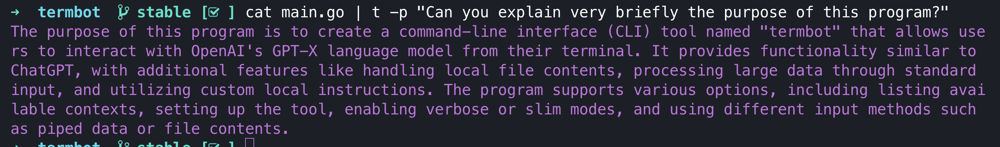

# Termbot

Termbot is a command-line tool for interacting with OpenAI’s GPT directly from your terminal.



---

ℹ️ **Version Note**

The original Termbot (Python) was fully rewritten in **Go (Golang)** as of version **v2.0.0**.
The previous **Python version** is still available here - [https://github.com/Argandov/termbot/tree/v1.0.0](https://github.com/Argandov/termbot/tree/v1.0.0) under the `v1.0.0` tag.

---

## Setup

1. **Clone the repository:**

```bash
git clone https://github.com/Argandov/termbot.git
```

2. **Finish setup:**

- Run `go build .` and move the termbot binary to your bin path 

Or simply run the helper script `setup.sh`. Examine the setup script first and adjust to your specific system setup if necessary.

3. **Run termbot setup**

```bash
termbot --setup
```

It will perform the following operations:

- Create a `$HOME/.env` file,
- Will ask for an OpenAI API Key, and upon receiving it, it will add it to your previously created `.env` file,
- Create termbot config folder inside `$HOME/.config/termbot`,
- Add a default System prompt ("Context") file in `$HOME/.config/termbot/context/default`

4. **Adjust as needed**

Modify the file `$HOME/.config/termbot/context/default` as needed. This is the default "system context" given to OpenAI to set the tone of the conversation. DO NOT change the name of this default file. It is the base system prompt used, unless specified otherwise (See "*context*" below in this README). 

Add additional contexts depending on your needs or what you want to do with Termbot. 
## Usage

This versatile tool can be used in Interactive, Prompt, or Context modes with numerous command-line options available. 

```
Usage:

  termbot [flags]

Flags:

  -c, --context string    Choose a context to use (default "default")

  -d, --dry-run           Print the prompts without actually running them

  -e, --examples          Print examples and additional usage

  -f, --file string       File input (absolute or relative)

  -h, --help              help for termbot

  -l, --list-contexts     List available contexts

  -p, --prompt string     LLM prompt (required)

      --setup-checklist   Make termbot set itself up in your system

  -m, --slim-mode         Enable slim mode (No ANSI colors)

  -v, --verbose           Enable verbose mode
```


If ran from a non-TTY, need to pipe termbot's output to a file, or ANSI colors is not supported, use always with `--slim-mode` or `-m`.

Termbot can handle input from local files or piped stdout, making it quite flexible in terms of usage:

  ```shell
  # Analyzing local files
  termbot -f config.yaml -p "Explain what this file does and analyze any potential errors"

  # Piping stdout into termbot
  cat README.md | termbot -p "What is this file about?"
  ```
  
  Or, "zero prompt mode":
  ```bash
termbot -f script.py -c code_analyzer
```
  
  where `code_analyzer` could be a generic context or prompt, that "analyzes code" or something.

# Suggested Usage

aliasing Termbot:

`alias t=termbot`

Also, if ANSI colors are not available (slim mode), we can simply alias `-m` together
# Modes of Operation

### Context Mode 

In this mode, you can create or edit custom context files in the context directory. This will provide instructions on how the Termbot responds to the given prompts, the so-called personality or 'mood'. You can list the current contexts by using the command `termbot -l`. This idea is 100% inspired by Daniel Miessler's [Fabric](https://github.com/danielmiessler/fabric)'s usage of "patterns".

Context files are inside `$HOME/.config/termbot/context/` folder. They do not need to follow any format and can be raw files without any extension (i.e. "default", "analyze_document", etc).
## Zero prompt option 

Requires input file `-f` flag and a context file `-c` flag:

`termbot -c analyze_script -f script.py`

Where "`analyze_script`" is a context file with specific instructions. 

## File path examples:

  `-f` can be used with either absolute or relative paths (The program with first seek relative, then absolute path if the first fails).

Hence:

`termbot -f hello.py `

Will seek first for hello.py in the current directory. If it's not found, it will search at `/hello.py`

## Dry Run & Verbosity:

Dry Run (`-d`) will print the prompt WITHOUT sending it to the LLM. This is useful for testing purposes (Whem using stdin pipes, files, etc.)

Verbosity (`-v` ) will simply be explicit and print the user prompt, system prompt and the LLM response.


## Releases & Versions

- `beta`: Early prototype version
- `v1.0.0`: Final Python-based Termbot version ([view here](https://github.com/Argandov/termbot/tree/v1.0.0))
- `v2.0.0`: Full rewrite in Go — this is the current and recommended version
